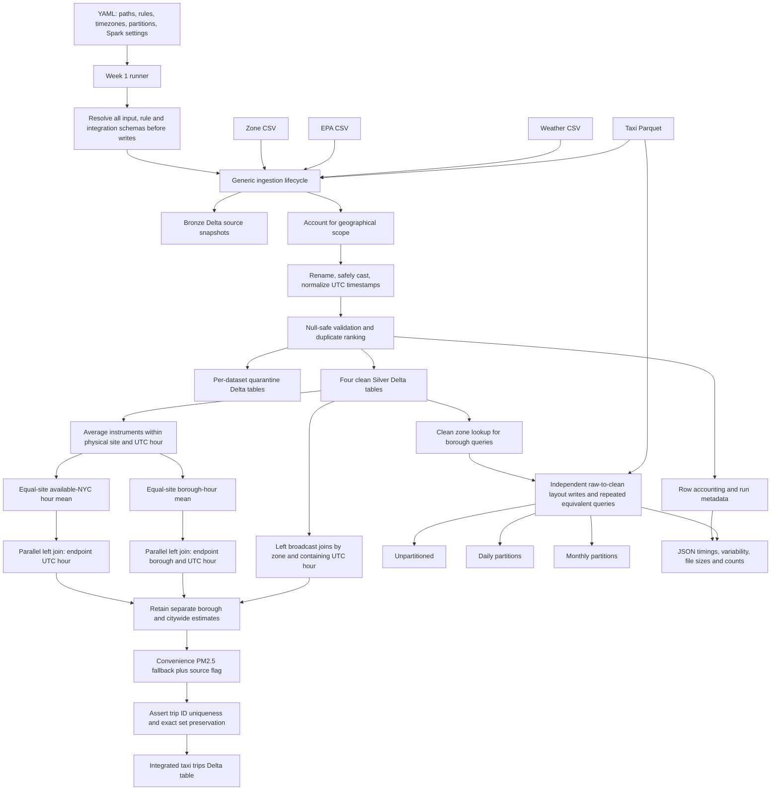

# Week 1 Architecture

The integrated dataset remains in the configured Silver directory. Quarantine
is append-only across runs; Bronze and Silver are replaced by full runs.
Benchmark output paths include a run ID. Diagrams deliberately omit fixed row
and file counts because they change when data or validation rules change.

The active YAML partitions taxi and integrated tables by local pickup year/month.
Small clean context tables are unpartitioned. The benchmark rereads raw taxi input;
it does not use the integrated table as its timed input. A standalone diagram is
available in `architecture.pdf` and `architecture.png`.

`pickup_pm25_borough` stays null without local coverage. `pickup_pm25_citywide`
is the same available-site estimate for every pickup in that UTC hour and is
null if no sites report. The convenience fallback and source flag are separate;
analogous dropoff columns use dropoff time and borough.
