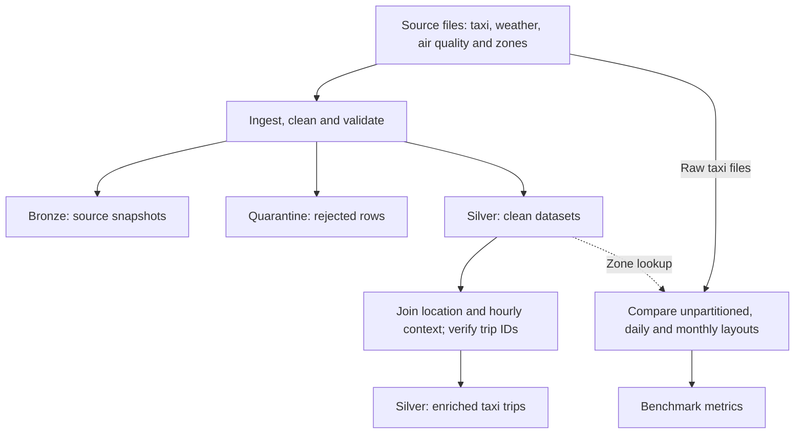

# Week 1 Architecture

The platform has two main paths. The ingestion and integration path turns four source datasets into an enriched taxi table. The benchmark path independently reads the raw taxi data to compare storage layouts. Both paths record evidence about their execution, as shown below.

## From source files to clean tables

The runner reads paths, validation rules, timezones, partition columns and Spark settings from YAML. Before writing any table, it resolves the input schemas, rules and integration schema. The shared ingestion lifecycle then creates a Bronze source snapshot, applies geographical scope and domain transformations, and classifies records through validation and duplicate ranking.

Accepted records become the four clean Silver tables. Invalid and duplicate rows are appended to separate quarantine tables, and ingestion metadata records the row accounting and execution details. Full runs replace Bronze and Silver snapshots, while quarantine accumulates rejected records across runs.

## Attaching context without changing trip identity

Integration uses left joins to attach endpoint zone labels and weather observations. Each pickup and dropoff is matched to its containing UTC hour. For air quality, instruments are first averaged within a physical site and hour; those site values are then weighted equally to calculate borough and citywide hourly estimates.

The output keeps these estimates separate. `pickup_pm25_borough` remains null when the pickup borough has no coverage. `pickup_pm25_citywide` is the same available-site estimate for every pickup in that UTC hour and remains null if no sites report. A separate convenience field applies the borough-to-citywide fallback, and a source flag records which estimate it uses. Equivalent dropoff fields use the dropoff time and borough.

Before writing the integrated table to the configured Silver directory, the pipeline verifies that trip IDs are unique and non-null and that the input and output contain exactly the same ID set. This prevents context joins from dropping trips or multiplying their records.

## Storage layout and benchmark path

The active YAML configuration partitions clean and integrated taxi tables by local pickup year and month. The small clean context tables remain unpartitioned. These production choices are separate from the benchmark, which independently rereads and cleans raw taxi input for unpartitioned, daily and monthly layouts. It uses the clean zone lookup for borough queries and does not time ingestion from the integrated table.

Benchmark paths include a run ID so each execution writes fresh output. JSON metrics retain timings, query variability, directory sizes and file counts. The diagram omits fixed row and file counts because they depend on the data and validation rules. Existing standalone exports are available as `architecture.pdf` and `architecture.png`; editing this Markdown does not regenerate them.
